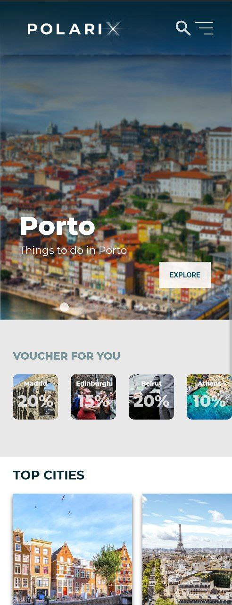
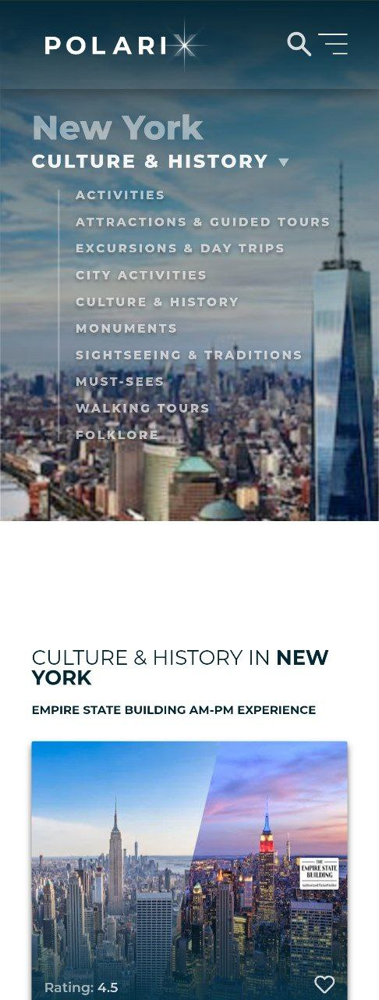
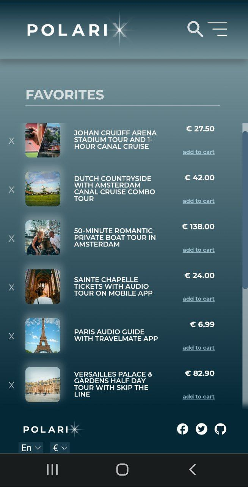
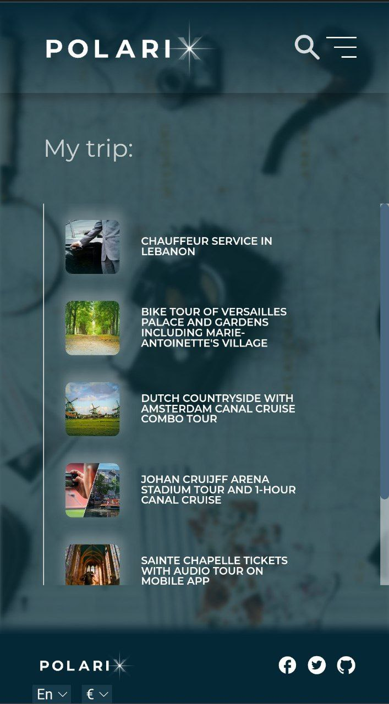

<div align="center">
  
</div>

<h2 style="text-align: center;">One app, one team.</h2>

<hr>

<h2 style="text-align: center;">Polarix, your stellar portal to discover, book and manage your
    travel experiences around the world. </h2>

<h4 {align="center"}> Created at Edgemony Coding Bootcamp #4 </h4>


<br>

<hr>

<h2>Technologies used include:</h2>
  <ul>
    <li>HTML</li>
    <li>SASS</li>
    <li>Javascript</li>
    <li>React.js</li>
    <li>Next.js</li>
    <li>Musement API</li>
    <li>Great Teamwork</li>
  </ul>

<br>
<hr>

<!--  -->

<br>

<h2>Features:</h2>
<ol>
  <li>Designed from scratch</li>
  <li>Concept based</li>
  <li>Mobile First</li>
  <li>SEO optimized</li>
  <li>UI and UX user friendly</li>
  <li>User interaction oriented</li>
  <li>Scalable and best practices</li>
</ol>


  <p align="right">
    
    
    
    
</p>

<br>
<hr>

This is a [Next.js](https://nextjs.org/) project bootstrapped with [`create-next-app`](https://github.com/vercel/next.js/tree/canary/packages/create-next-app).

## How to run it!

First, run the development server:

```bash
npm run dev
# or
yarn dev
```

Open [http://localhost:3000](http://localhost:3000) with your browser to see the result.

You can start editing the page by modifying `pages/index.js`. The page auto-updates as you edit the file.

[API routes](https://nextjs.org/docs/api-routes/introduction) can be accessed on [http://localhost:3000/api/hello](http://localhost:3000/api/hello). This endpoint can be edited in `pages/api/hello.js`.

The `pages/api` directory is mapped to `/api/*`. Files in this directory are treated as [API routes](https://nextjs.org/docs/api-routes/introduction) instead of React pages.

<br>
<hr>

## Presentation day

<h4>Saturday, October 8th, 2022</h4>
<a href="https://project-north.vercel.app/">Follow this link to visit it!</a>
<hr>
<h3>Made with ❤️ by:</h3>
<ul>
  <li>
    <a href="https://www.linkedin.com/in/noemi-fazio/">
        Noemi Fazio
    </a>
  </li>
  <li>
    <a href="https://www.linkedin.com/in/marco-guglielmino/">
      Marco Gugliemino
    </a>
  </li>
  <li>
    <a href="https://www.linkedin.com/in/drichard-mangano/">
      Richard Mangano
    </a>
  </li>
  <li>
    <a href="https://www.linkedin.com/in/eleonora-rizzitello/">
      Eleonora Rizzitello
    </a>
  </li>
  <li>
    <a href="https://www.linkedin.com/in/martina-venasco/">
      Martina Venasco
    </a>
  </li>
</ul>

</h4>
